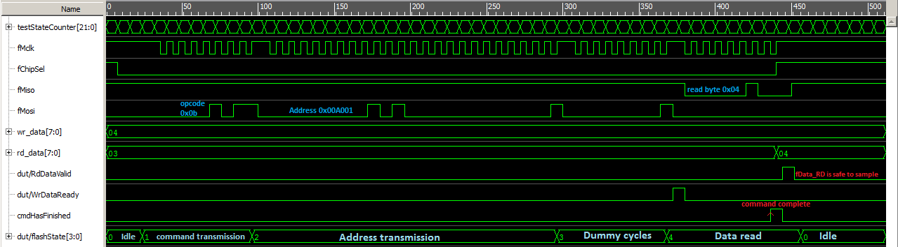

# nano4k_spi_nor_flash
Simple Verilog interface for the PUYA P25Q32H flash chip of the Tang Nano 4K board

Work in Progress.

[Refer to the PUYA P25Q32H datasheet for more info.](https://www.puyasemi.com/uploadfiles/2018/08/201808071524332433.pdf)

The main interface module is src\nano4k_spi_flash, it consists of a state machine representing the states of a SPI flash instruction and serializer/deserializer blocks.

To use it, supply a command to the fCommand bus(make sure to only use the commands defined in the "nano4k_spi_flash.v" file), supply a 24-bit address to fAddress and one byte of write data to fData_WR if you intend to use a write instruction. Then assert interfaceEnable_n by driving it LOW.

When cmdFinished goes high it indicates that the instruction will be completed by the next rising serialClk edge, and the flash interface can be safely disabled without violating the byte boundary for certain instructions like Page Program.

When WrDataReady goes high, it indicates that the flash interface will begin transmitting byte n, and is ready to accept byte n+1 which will sampled 7 serialClk cycles later.

When RdDataValid goes high, it indicates that the fData_RD read data is valid and can be sampled safely.

# Currently supported commands

FREAD (0x0B): Read flash data started from supplied address one byte at a time, keep interface active to read up to the entire flash chip if desired, supports a max frequency of about 120MHz but sends a dummy byte before it begins actual reading.

RDCR (0x15): Read the flash chip's configuration register. (see pg. 31 of datasheet)

RDSR (0x05): Read the flash chip's status register to check the busy flag/write enable status etc. (see pg. 29)

RDID (0x9F): Read hardwired manufacturer ID and other info, expect bytes 0x85, 0x60 and 0x15 for this specific PUYA flash chip.

READ (0x03): Similar to FREAD, reads data starting from the supplied address, does not transmit a dummy byte but it only supports a max frequency of 70MHz.

RSTEN (0x66): Makes the flash chip reset-able through the instruction RST.

RST (0x99): Resets the flash chip.

PP (0x02): Page program, write bytes starting at the given address. If interface is kept active for more than 256 bytes the erase will wrap around to the set address. Automatically resets the write enable latch when done.

PE (0x81): Page erase, erases the page that contains the given address, the least significant of the address byte is irrelevant since the entire page (256 bytes) will be erased from 0xXXXX00 to 0xXXXXFF, keep in mind that with flash chips you need to erase a location before you can actually write to it. Automatically resets the write enable latch when done.

WREN (0x06):	Set the write enable latch, remember to issue this command before erase/program instructions.

# Included test

Use the Gowin Analyzer Oscilloscope to snoop around in the example project ("nano4k_spi_flash_top.v"). 

Example of issuing the command FREAD to the interface, the interface is disabled by the top module when cmdFinished goes high:

